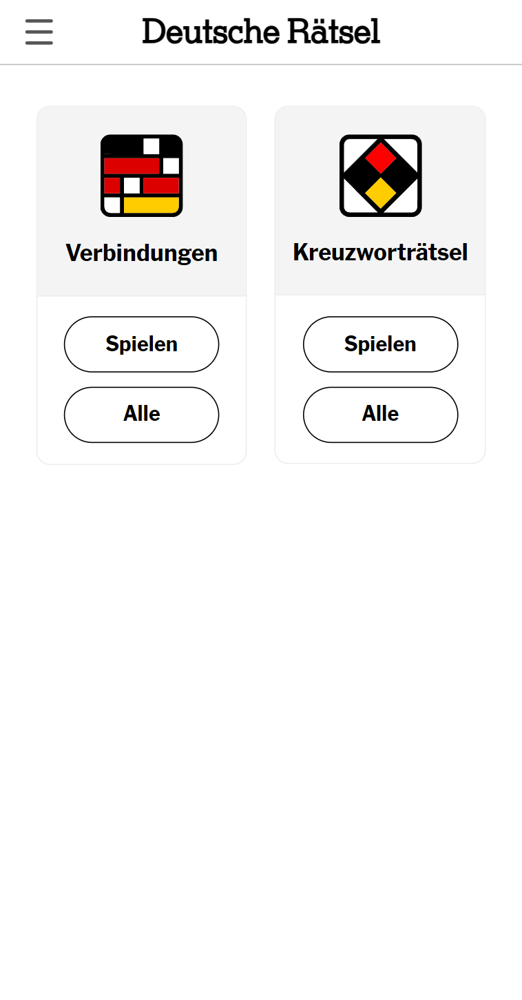
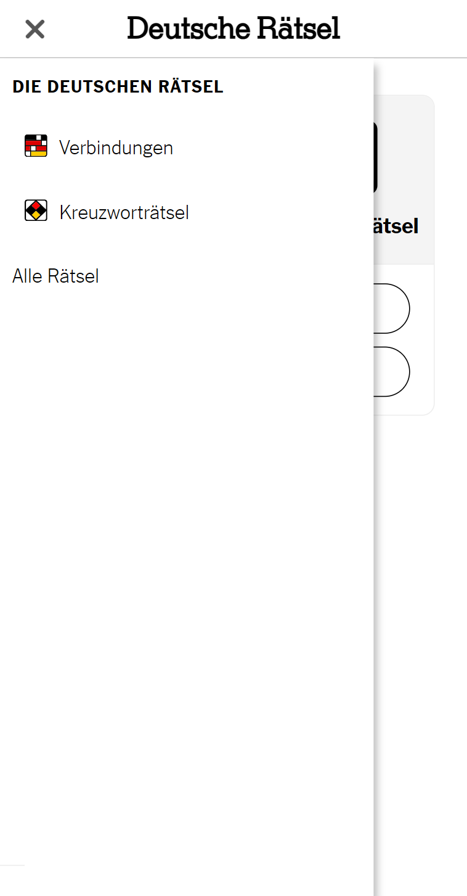
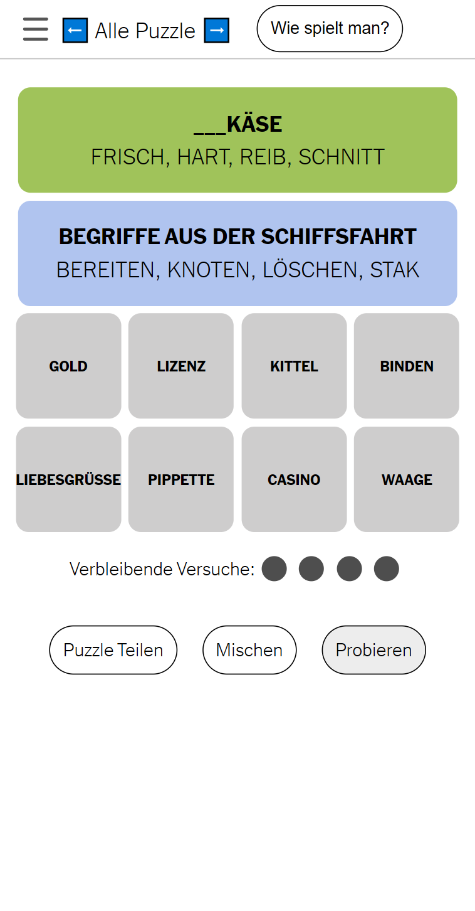
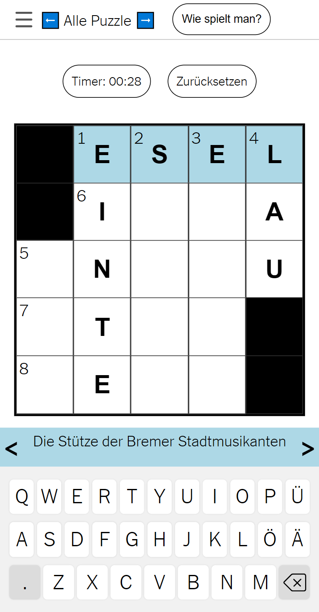
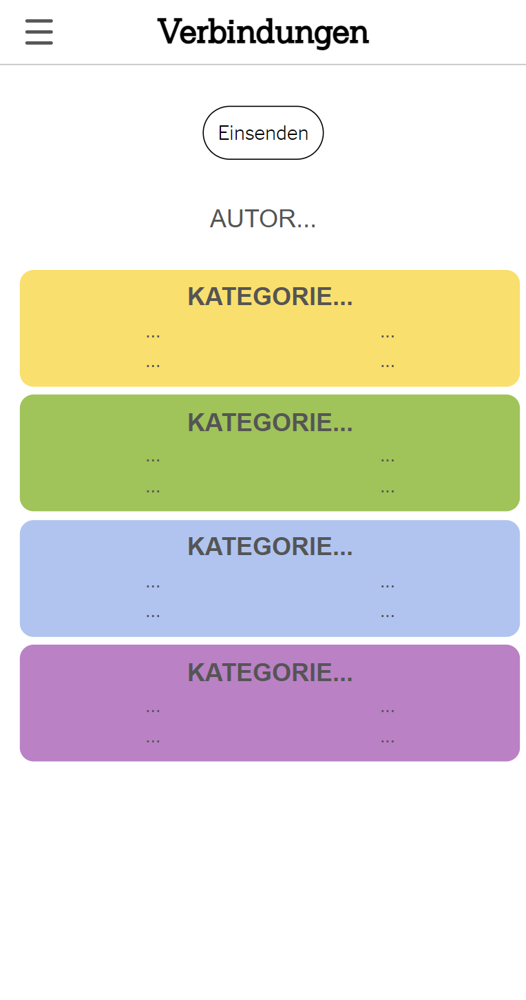

<p align="center">
	
</p>

# Modular-Games: a NYT Games Clone

Try it out at [spiele.obrhubr.org](spiele.obrhubr.org).

This site offers two puzzle games published by the New York Times, but in german, [Connections](https://www.nytimes.com/games/connections) and their [Mini-Crossword](https://www.nytimes.com/crosswords/game/mini).
The goal was to recreate the games as simply as possible, in pure html, css and javascript (without the help of a framework). This allowed me to build first versions of Connections in about 24h.

## Creating a DIY Framework

Because the puzzle games need a lot of the similar functionality (a page to see all puzzles, navigating between the puzzles, loading the current puzzle from the database, etc...) I wanted to keep the amount of duplicated code to a minimum. This naturally lead me to consider building each game as a sort of plug-and-play html code that operated in isolation from the rest of the site's functionality.

This means that each game (found in the `./games` folders) has to have a `play.html` page (which is the game itself). This page calls `puzzleLoadEvent()` on load, which is a shared function that returns the `json` that corresponds to the current puzzle. This abstracts away any db interactions from the game's logic. Once the game has finished `puzzleEndEvent()` is called, which logs results automatically and handles showing the results.

Each game also provides an `add.html` page which handles adding game and similarly interfaces with shared functions instead of the db directly.

But to make this possible I somehow had to composite the different html pages together. I was inspired by the way Jekyll, the framework I use for my blog, works. Each page specifies a layout that should be used to render the page. You can then use `{{ variable }}` tags, that get replaced dynamically by the variable on rendering.

I implemented a very simple solution that works essentially the same way in `compile.py`, using regex. It first renders the basic pages for the site and then loops through every folder in `./games` and adds the games to the site. You can use `{{ variable }}` as with Jekyll, but I also provide `` tags to dynamically load html sites. These get replaced by the html in the file. You can also use `{* if (condition) *} ... {* ifend *}` tags to load html based on conditions dynamically. This allows me to customise what gets shown in the navigation bar on the homepage and while playing a game for example.

## Hosting the site

The original site was hosted on Github Pages, but I wanted to add the possibility for my friends to add puzzles too, so I switched to Firebase.

Using Firebase allowed me to add a few very important features. First is the loading of puzzles from a database (specified by an ID encoded in the URL parameter, allowing simple navigation) and of course the possibility of creating and uploading a new puzzle directly from a webpage.

## The site

The title bar shows the ID of the current puzzle and also the date of creation. This allows users to easily share the puzzle with others, through URL parameters: `spiele.obrhubr.org/verbindungen/play.html?number=K161sMaSf8UE60hcTh45` links to that puzzle directly.
It is also possible to navigate between the puzzles in chronological order with the arrow buttons. They call the Firestore API to fetch the puzzle id and reload the page with the correct URL parameter.

After the user has completed the puzzle, a popup appears with the results. It shows the steps the user took to solve it and a button that allows him to copy this short message, enabling him to share his game with friends.

```
Verbindungen Puzzle: K161sMaSf8UE60hcTh45
🟩🟨🟨🟪
🟩🟨🟩🟩
🟩🟩🟩🟩
🟦🟦🟨🟦
🟦🟦🟦🟪
🟪🟨🟪🟪
spiele.obrhubr.org/verbindungen/play.html?number=K161sMaSf8UE60hcTh45
```

### Screenshots from the site

<p align="center">
	
	
	
	
	
	
</p>